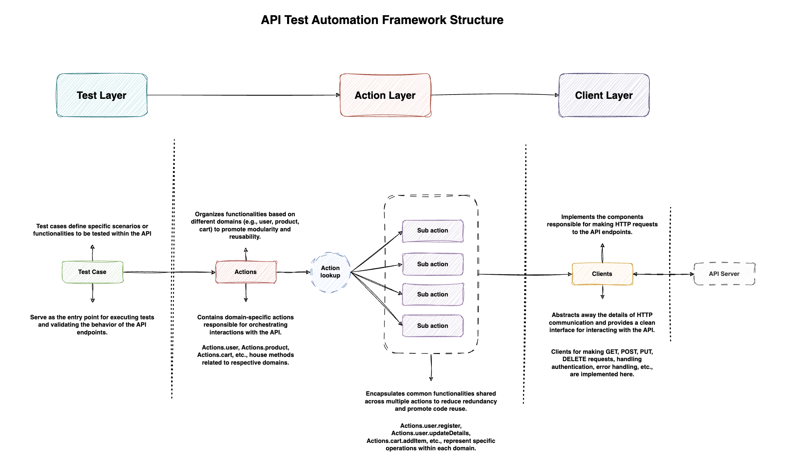
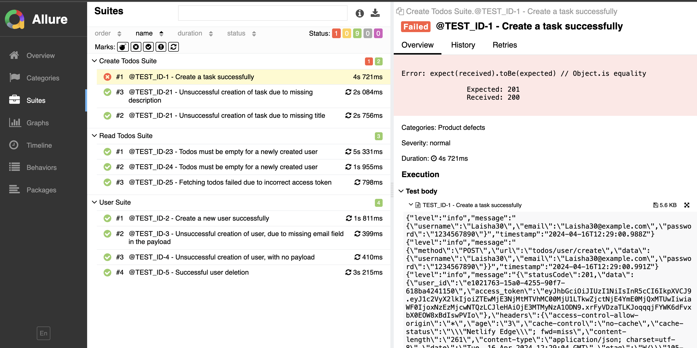
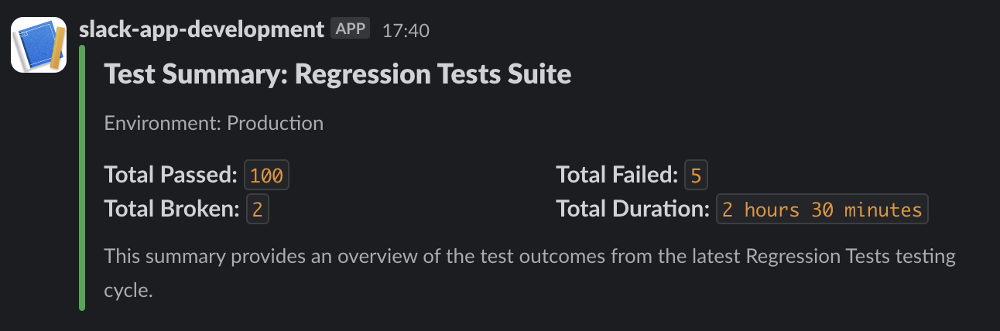
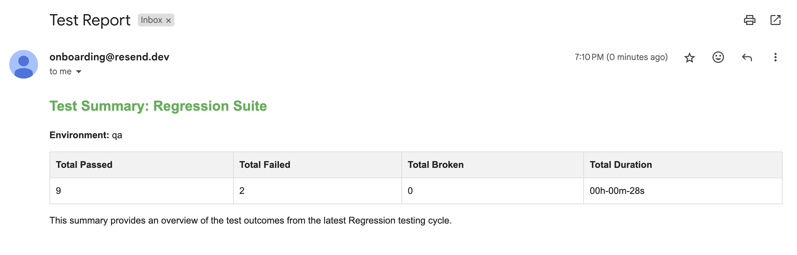
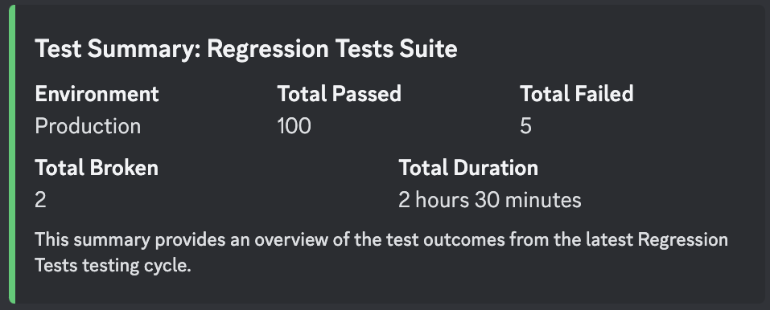
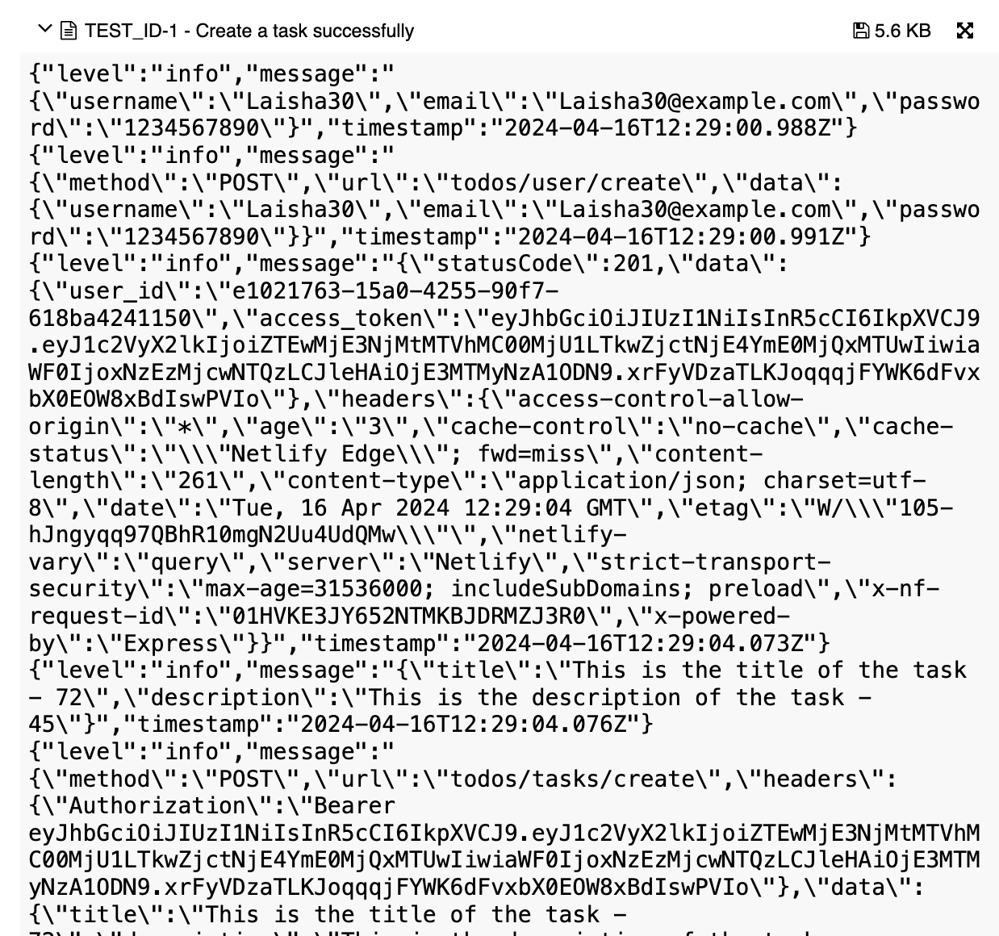
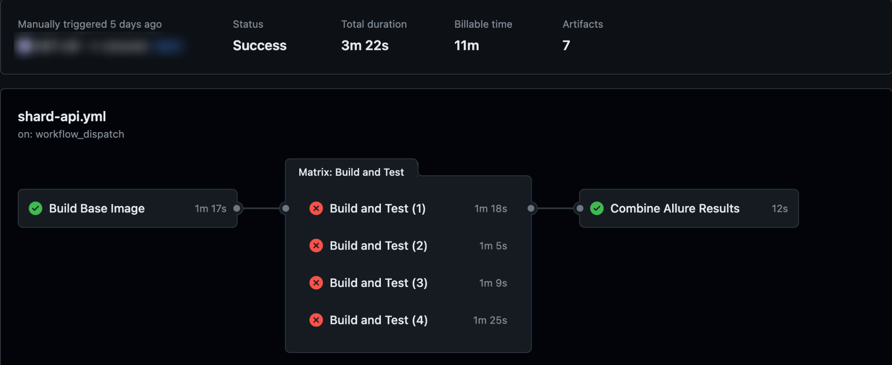

# API Automation Framework Template

Welcome to the TypeScript API Automation Framework repository! This framework is designed to streamline the process of writing and executing automated tests for various E2E API end-points.

Below is an overview of the framework architecture, folder structure, features, how to use this framework and in-sights.

## Framework Architecture



## Folder Structure Mapping

```
+-- config
|   +-- <configuration files>
|
+-- scripts
|   +-- <script files for automation tasks>
|
+-- setup
|   +-- <setup and teardown scripts>
|
+-- src
|   +-- actions
|   |   +-- <action files for interacting with the system under test>
|   |
|   +-- clients
|   |   +-- <client files for making requests to the system under test>
|   |
|   +-- data
|   |   +-- request
|   |   |   +-- <sub-folders of request models based on business domain>
|   |   |
|   |   +-- response
|   |       +-- <sub-folders of response models based on business domain>
|   |
|   +-- models
|   |   +-- request
|   |   |   +-- <sub-folders of request models based on business domain>
|   |   |
|   |   +-- response
|   |       +-- <sub-folders of response models based on business domain>
|   |
|   +-- utils
|       +-- <utility files for common functionalities>
|
+-- tests
    +-- <test-suite>
        +-- <test-module>.spec.ts
```

1. **Configuration**: Update the configuration files in the `config` folder as per the requirements based on the test environment ( `qa`, `stage` or `prod` ).

2. **Scripts**: Utilize the script files in the `scripts` folder for automation tasks like execution, reporting, and notification.

3. **Setup**: Customize the setup and teardown scripts in the `setup` folder to prepare the test environment.

4. **Actions**: Write action files in the `src/actions` folder to interact with the system under test.

5. **Clients**: Implement client files in the `src/clients` folder for making requests to the system under test.

6. **Data Models**: Define request and response models in the `src/models` folder based on the business domain.

7. **Utilities**: Utilize utility files in the `src/utils` folder for common functionalities needed in the tests.

8. **Tests**: Write test modules in the `tests` folder to automate test cases for the application.

## Feature Table

| Feature                                   | Description                                                                                                                 | Status | Customizable | Images                                                         |
| ----------------------------------------- | --------------------------------------------------------------------------------------------------------------------------- | ------ | ------------ | -------------------------------------------------------------- |
| Allure Report                             | Generates detailed test execution reports                                                                                   | ✓      | Yes          |          |
| Slack Notification                        | Sends test execution notifications to Slack                                                                                 | ✓      | Yes          |      |
| Email Notification                        | Sends test execution notifications via email                                                                                | ✓      | Yes          |      |
| Discord Notification                      | Sends test execution notifications to Discord                                                                               | ✓      | Yes          |  |
| Logging                                   | Logs test execution details                                                                                                 | ✓      | Yes          |                  |
| CI/CD Integration (`Github Actions`)      | Executes tests concurrently for faster run time                                                                             | ✓      | Yes          |       |
| Parallel Execution                        | Executes tests concurrently for faster run time                                                                             | ✓      | Yes          |                                                                |
| Test Case Addition                        | Average of 5-15 min to write a new test case ( technical good with language syntax and API flow understanding is required ) | ✓      | N / A        |                                                                |
| New Feature Addition within the framework | Ensures adding a new feature within the framework is decoupled and integration won't break                                  | ✓      | Yes          |                                                                |

## How to add the test case

The following is the flow diagram for test case creation:

```
API Endpoint ( Postman / Swagger / cURL command ) --> Identify Endpoint and Payload --> Create Request and Response Models --> Implement Client Method --> Create Actions --> Write Test Case in Test Module --> Run Tests
```

1. **Identify the API Endpoint**:

    ```
    curl --location 'https://friendly-boba-c46af4.netlify.app/todos/user/create' \
        --header 'Content-Type: application/json' \
        --data-raw '{
        "username": "example_user_5",
        "password": "password123",
        "email": "example@example_5.com"
        }'
    ```

2. **Create Request and Response Models**:

    - Request Model:

        ```typescript
        export interface SuccessfulUserCreationRequestModel {
            username: string;
            email: string;
            password: string;
        }

        export interface SuccessfulUserCreationResponseModel {
            user_id: string;
            access_token: string;
        }
        ```

3. **Implement Client Method**:

    - Client Method:

        ```typescript
        @Service({ transient: true })
        export class UserClient {
            async createUser<U, V>(data: U): Promise<ResponseConfig<V>> {
                const response = await Request.builder<U, V>()
                    .method("POST")
                    .resourceEndpoint("todos/user/create")
                    .payload(data)
                    .send();

                return response;
            }
        }
        ```

4. **Create Actions**:

    - Actions:

        ```typescript
        @Service({ transient: true })
        export class UserActions {
            private readonly userClient: UserClient;

            constructor() {
                this.userClient = Container.get(UserClient);
            }

            async successfulUserCreation(
                data: SuccessfulUserCreationRequestModel
            ): Promise<ResponseConfig<SuccessfulUserCreationResponseModel>> {
                const response = await this.userClient.createUser<
                    SuccessfulUserCreationRequestModel,
                    SuccessfulUserCreationResponseModel
                >(data);
                return response;
            }
        }
        ```

5. **Write Test Case in Test Module**:

    ```typescript
    let userClient: UserClient;

    beforeEach(() => {
        // Logger initialization
        loggerInitializationHook(expect.getState().currentTestName as string);

        //  Fetching the client objects
        userClient = Container.get(UserClient);
    });

    afterEach(() => {
        addLogsToAllure(expect.getState().currentTestName as string);
    });

    // Test Case
    describe("User Suite", () => {
        it("@TEST_ID-1234 - Create a new user successfully", async () => {
            // Arrange
            const data = RequestDataGenerator.createUserPayload() as SuccessfulUserCreationRequestModel;

            // Act
            const response = await Actions.user.successfulUserCreation(data);

            // Assert
            expect(response.statusCode).toBe(201);
            expect(response.data?.user_id).toBeTruthy();
            expect(response.data?.access_token).toBeTruthy();
        });
    });
    ```

6. **Run Tests**:

    - Execute the test script using the following command - `npm run test <test_id_number>`

    - In my case, considering the above example,

    ```
    npm run test 1234
    ```

# In-sights

## Usage of Service annotation

### What is Dependency Injection (DI)?

Dependency Injection is a design pattern used to facilitate loose coupling between components in an application. Instead of a component creating its dependencies directly, they are provided (injected) from outside. This promotes modularity, testability, and maintainability by allowing dependencies to be easily swapped or mocked.

### Example without Dependency Injection:

```typescript
class UserService {
    // Implementation of user-related functionality
}

// In test case:
const userService = new UserService(); // Explicit instantiation
```

In this example, the `UserService` class is instantiated directly within the test case. This tightly couples the test case to the implementation details of `UserService`, making it harder to test and maintain.

### Introduction to typedi and @Service:

In TypeScript applications, `typedi` is a popular library for managing dependencies and enabling DI. The `@Service` decorator from `typedi` marks a class as a service, allowing it to be injected where needed.

### Example with Dependency Injection using typedi and @Service:

```typescript
// Import typedi
import { Service } from "typedi";

// Define UserService as a service
@Service({ transient: true })
class UserService {
    // Implementation of user-related functionality
}

// In test case:
const userService = Container.get(UserService); // Dependency injected by typedi
```

By decorating the `UserService` class with `@Service({ transient: true })`, we indicate that it is a service and should be managed by `typedi`. The `{ transient: true }` option ensures that a new instance is created each time it is injected, promoting isolation and preventing unintended side effects.

In the test case, we use `Container.get(UserService)` to retrieve an instance of `UserService` that has been injected with its dependencies.

### Benefits of Dependency Injection with typedi:

1. **Modularity**: Dependency Injection promotes modularity by decoupling components and allowing them to be easily replaced or modified without affecting other parts of the application.

2. **Testability**: Components can be tested in isolation with their dependencies mocked or replaced, leading to more focused and reliable unit tests.

3. **Maintainability**: DI makes code easier to understand and maintain by reducing dependencies between components and promoting separation of concerns.
